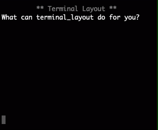
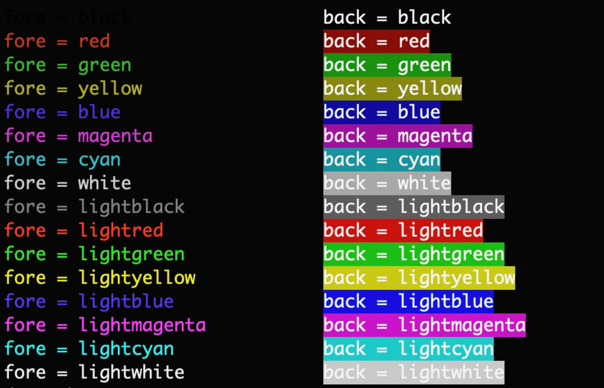
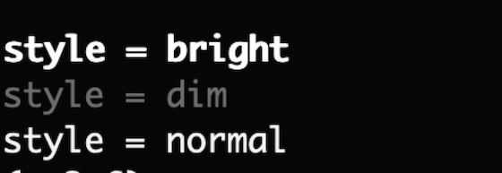
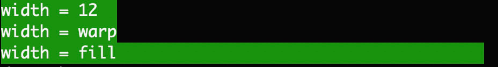
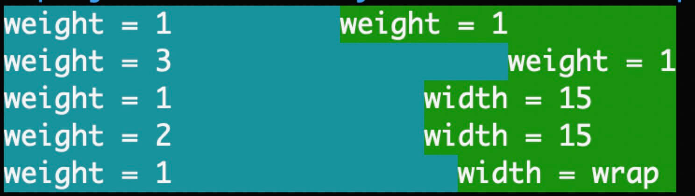
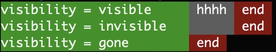
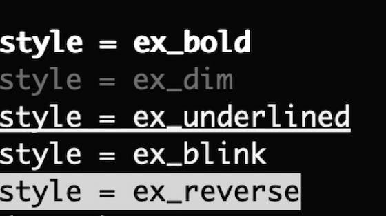

# terminal_layout

The project help you to quickly build layouts in terminal  
(这个一个命令行ui布局工具)



----------------

**Some extensions base on terminal_layout**

* [progress](terminal_layout/extensions/progress/README.md)


* [choice](terminal_layout/extensions/choice/README.md)


-------------------

** video demo **

<a href="https://asciinema.org/a/226120">

</a>


# link

* [Github](https://github.com/gojuukaze/terminal_layout) 
* [中文README](README.ZH.md) 
* [Docs](https://terminal-layout.readthedocs.io) 
* [https://asciinema.org/a/226120](https://asciinema.org/a/226120) 

# install 
```bash
pip install terminal-layout
```

# Dependencies
* Python 2.7, 3.5+ (maybe 3.4)
* Linux, OS X, and Windows systems.

# Usage

 * easy demo:

```python
import time
from terminal_layout import *

ctl = LayoutCtl.quick(TableLayout,
                      # table id: root
                      [
                          [TextView('t1', 'Hello World!', width=Width.fill, back=Back.blue)],  # <- row id: root_row_0,
                          [TextView('t2', '', fore=Fore.magenta)],  # <- row id: root_row_1,
                      ],
                      )

# or layout=ctl.get_layout()
layout = ctl.find_view_by_id('root')
layout.set_width(20)

# default: auto_re_draw=True
ctl.draw()

# call delay_set_text() must be set auto_re_draw=True,
# otherwise you must start a thread to call re_draw() by yourself
ctl.find_view_by_id('t2').delay_set_text('你好,世界!', delay=0.2)

time.sleep(0.5)
row3 = TableRow.quick_init('', [TextView('t3', 'こんにちは、世界!')])
layout.add_view(row3)

# If you call draw() with auto_re_draw=True, you must stop()
ctl.stop()

```


* disable auto_re_draw

```python
import time
from terminal_layout import *

ctl = LayoutCtl.quick(TableLayout,
                      # table id: root
                      [
                          [TextView('t1', 'Hello World!', width=Width.fill, back=Back.blue)],  # <- row id: root_row_1,
                          [TextView('t2', '', fore=Fore.magenta)],  # <- row id: root_row_2,
                      ],
                      )


layout = ctl.find_view_by_id('root')
layout.set_width(20)

ctl.draw(auto_re_draw=False)

ctl.find_view_by_id('t2').set_text('你好,世界!')
ctl.re_draw()

time.sleep(0.5)
row3 = TableRow.quick_init('', [TextView('t3', 'こんにちは、世界!')])
layout.add_view(row3)
ctl.re_draw()

# don't need call stop()
# ctl.stop()
```

 * use python2 unicode

```python
# -*- coding: utf-8 -*-
from terminal_layout import *
import sys
reload(sys)
sys.setdefaultencoding('utf-8')

ctl = LayoutCtl.quick(TableLayout,
                      [
                          [TextView('', u'中文，你好', back=Back.cyan, width=Width.wrap)],
                          [TextView('', u'中文，你好', back=Back.cyan, width=6)],
                          [TextView('', u'日本語，こんにちは', back=Back.cyan, width=Width.wrap)],
                      ]

                      )

ctl.draw()

```


## Properties

 * fore & back
 
```python
TextView('','fore',fore=Fore.red)
TextView('','back',back=Back.red)
```



 * style

```python
TextView('','style',style=Style.dim)
```



 * width
 
```python
TextView('','width',width=10)
```




 * weight
 
```python
TextView('','weight',weight=1)
```



 * gravity
 
```python
TextView('','gravity',gravity=Gravity.left)
```


 * visibility
 
```python
TextView('','',visibility=Visibility.visible)
```




 * ex_style (not support windows)


```python
TextView('','ex_style',style=Style.ex_blink)
```



 * ex_fore & ex_back (not support windows)


```python
TextView('','ex_fore',fore=Fore.ex_red_1)
TextView('','ex_back',back=Back.ex_red_1)

```


# LICENSE

[GPLv3](https://github.com/gojuukaze/terminal_layout/blob/master/LICENSE)

# Thanks

 * [colorama](https://github.com/tartley/colorama) : Simple cross-platform colored terminal text in Python
 * [colored](https://gitlab.com/dslackw/colored) : Very simple Python library for color and formatting in terminal
