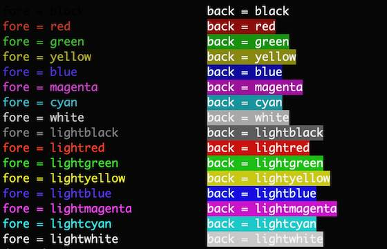
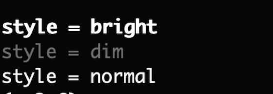
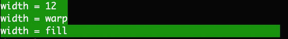
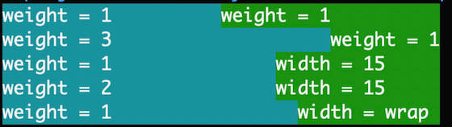
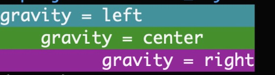
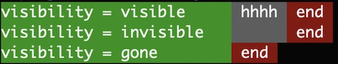
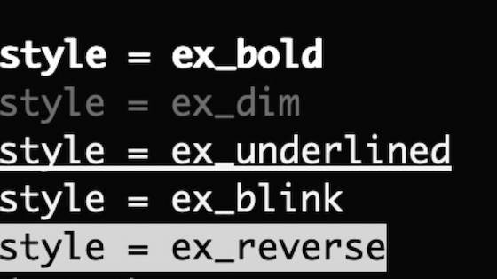
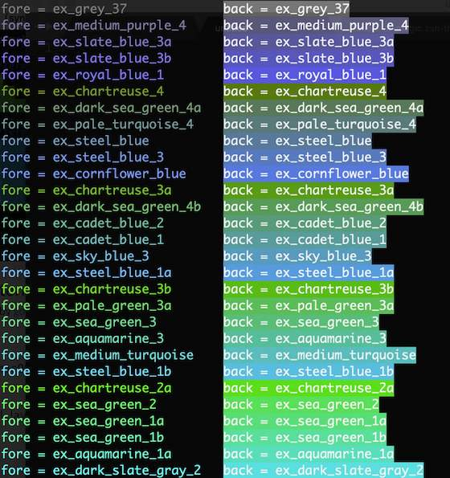

属性效果说明
===============

属性效果展示

fore & back
-------------

颜色，背景色
所有值参考 ``Fore`` ，``Back`` 类

.. code:: python

   TextView('','fore',fore=Fore.red)
   TextView('','back',back=Back.red)

|image5|

style
-------

样式
所有值参考 ``Style`` 类

.. code:: python

   TextView('','style',style=Style.dim)

|image6|

width
--------
宽度

* 正整数 ：表示所占的字符位数，ascii码占1位，非ascii码占2位
* Width.wrap ：根据内容决定宽度
* Width.fill ：填满父布局

.. code:: python

   TextView('','width',width=10)

|image7|

weight
--------
比重

值是正整数，表示所占比重。

.. code:: python

   TextView('','weight',weight=1)

weight=2 表示宽度所占比重为2。

比如:

.. code-block:: python

    # t1 real_width=2 , t2 real_width=4
    TableRow('',[TextView('t1','',weight=1), TextView('t2','',weight=2),] , width=6)

当同时设置weight与width时，使用weight确定宽度

.. code-block:: python

    # t1 real_width=3
    TableRow('',[TextView('t1','',weight=1, width=10), ] , width=3)

当其他view设置了width时，设置有weight的view按比重分配剩下的宽度

.. code-block:: python

    # t2 real_width=2 ,t3 real_width=4
    TableRow('',
            [
                TextView('t1','',width=10),
                TextView('t2','',weight=1),
                TextView('t3','',weight=2),
            ] ,

            width=16)

|image8|

gravity
----------

对齐方式

* Gravity.left ： 居左
* Gravity.center ： 居中
* Gravity.right ： 居右

.. code:: python

   TextView('','gravity',gravity=Gravity.left)

|image9|

visibility
-----------
是否显示

* Visibility.visible ：显示
* Visibility.invisible ：不显示，当占宽度
* Visibility.gone ：不显示，不占宽度

.. code:: python

   TextView('','',visibility=Visibility.visible)

|image10|

ex_style
----------

``ex_`` 开头的字体样式，不支持windows

.. code:: python

   from terminal_layout import *
   TextView('','ex_style',style=Style.ex_blink)

|image11|

ex_fore & ex_back
-------------------

``ex_`` 开头颜色，背景色，不支持windows

.. code:: python

   from terminal_layout import *
   TextView('','ex_fore',fore=Fore.ex_red_1)
   TextView('','ex_back',back=Back.ex_red_1)

|image12|

