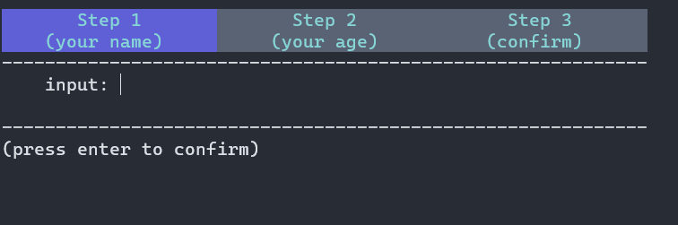
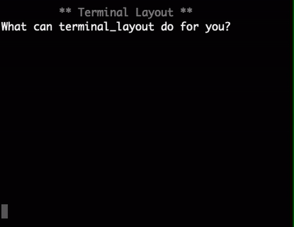

.. terminal_layout documentation master file, created by
   sphinx-quickstart on Sun Feb 10 14:41:08 2019.
   You can adapt this file completely to your liking, but it should at least
   contain the root `toctree` directive.

Welcome to terminal_layout's documentation!
===========================================

| The project help you to quickly build layouts in terminal
| (这个一个命令行ui布局工具)

.. image:: https://asciinema.org/a/226120.svg
   :target: https://asciinema.org/a/226120

你可以从 :doc:`getStarted` 开始学习如何使用terminal_layout

Link
===============

-  `All
   Demo <https://github.com/gojuukaze/terminal_layout/tree/master/demo>`__
-  `Github <https://github.com/gojuukaze/terminal_layout>`__
-  `Docs <https://terminal-layout.readthedocs.io>`__
-  `https://asciinema.org/a/226120 <https://asciinema.org/a/226120>`__

------------

.. toctree::
   :maxdepth: 1

   getStarted
   installation
   draw
   keyListener
   Properties
   View
   extensions/index
   changelog
   FAQ

