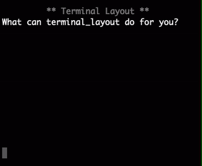

.. terminal_layout documentation master file, created by
   sphinx-quickstart on Sun Feb 10 14:41:08 2019.
   You can adapt this file completely to your liking, but it should at least
   contain the root `toctree` directive.

Welcome to terminal_layout's documentation!
===========================================

| The project help you to quickly build layouts in terminal
| (这个一个命令行ui布局工具)

.. image:: https://asciinema.org/a/226120.svg
   :target: https://asciinema.org/a/226120

.. toctree::
   :maxdepth: 2

   introduction
   installation
   tutorial/index
   LayoutCtl
   View
   Properties
   FAQ

Indices and tables
==================

* :ref:`genindex`
* :ref:`modindex`
* :ref:`search`
