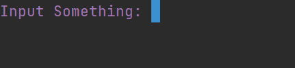

# input ex

Read input string.   
注意：必须和 Textview 配合使用

**Unsupport Windows**  




### usage

```python
from terminal_layout import *
from terminal_layout.extensions.input import *

ctl = LayoutCtl.quick(TableRow,
                      [TextView('', 'Input Something: ', fore=Fore.magenta),
                       TextView('input', '', width=11, fore=Fore.blue)])
ctl.draw()
ok, s = InputEx(ctl).get_input('input')
if ok:
    print('-------')
    print('Your input:', Fore.blue, s, Fore.reset)
```

There are several parameter you can set:

| name            | default                         | desc              |
|-----------------|---------------------------------|-------------------|
| input_buffer    |  30                             | io read buffer    |
| max_length      |  None                           | max input char    |
