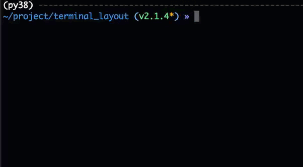
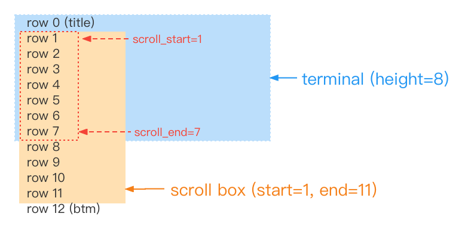

# scroll

Let `TableLayout` support scrolling.

Note: **Must be used with `TableLayout` and `TableRow`!!**



## usage

```python
from terminal_layout import *
from terminal_layout.extensions.scroll import *

rows = [[TextView(str(i), str(i))] for i in range(50)]

ctl = LayoutCtl.quick(TableLayout, rows)
# ctl.enable_debug(height=13)
scroll = Scroll(ctl, stop_key='q', loop=True, more=True, scroll_box_start=3)
scroll.scroll()

```

There are several parameter you can set:

| **name**             | **default** | **desc**                                                                                                                                                 |
|----------------------|-------------|----------------------------------------------------------------------------------------------------------------------------------------------------------|
| ctl                  |             | LayoutCtl                                                                                                                                                |
| stop_key             | Key.ESC     | key to stop scrolling                                                                                                                                    |
| up_key               | Key.UP      |                                                                                                                                                          |
| down_key             | Key.DOWN    |                                                                                                                                                          |
| scroll_box_start     | 0           | The row to start scrolling from. If the title is to be displayed on the first row, set scroll_box_start=1 (see the final cal_scroll section for details) |
| default_scroll_start | 0           | When initializing, which row in scroll_box is displayed at the first position.                                                                           |
| loop                 | False       |                                                                                                                                                          |
| btm_text             | ''          | The text at the bottom, if it is empty, it will not be displayed                                                                                         |
| more                 | False       | Similar to the behavior of man. Its value is True will automatically add btm_text                                                                        |
| callback             | None        | Callback after scrolling                                                                                                                                 |
| re_draw_after_scroll | True        | Whether to perform a redraw after scrolling. If set to false you need to call re_draw yourself                                                           |
| re_draw_after_stop   | False       | Whether to redraw after stopping scrolling                                                                                                               |


> default_scroll_start Description  
> If the terminal height is 4, the table has 6 rows (height is 6), default_scroll_start=6.    
> When drawing, what is shown at the top of the terminal is row_2.
> ```
>   row_0
>   row_1
> |------------|
> | row_2      |
> | row_3      |  <=== terminal, h=4
> | row_4      |
> | row_5      |
> |------------|
> ```
  

## Modify scroll event behavior

There are various ways to modify the behavior after scrolling

### 1. Modify by callback

```python
from terminal_layout.extensions.scroll import *

ctl = ...
scroll = ...


def my_callback(event):
    if event == ScrollEvent.up:
        ...
        # or ctl.re_draw()
        scroll.draw()
    # ...

```

`up`, `down` events will perform `re_draw` by default before calling callback. If you modify the view in the callback, you need to call the function to redraw.

If you change the row of the table in your callback, you should use `scroll.draw()` This function will recalculate the scroll position.

### 2. override scroll event

If you want to do something before calculating the scroll position (for example: disallow scroll-up cycles, but allow down-scroll cycles),
You need to override the scroll event.

There are various ways to override the scroll event.

* Override by `stop_func`, `up_func`, `down_func`

  ```python
  from terminal_layout.extensions.scroll import *
  
  ctl = LayoutCtl(...)
  scroll = Scroll(ctl, loop=True)
  
  def up(kl, event):
    if scroll.current_scroll_start - 1 < scroll.scroll_box_start:
        return 
    scroll.up()
    ctl.re_draw()
  
  scroll.scroll(up_func=up)
  ```

* Add `key_listener` event

  ```python
  from terminal_layout.extensions.scroll import *
  from terminal_layout.readkey import Key
  
  ctl = LayoutCtl(...)
  scroll = Scroll(ctl, up_key=None, loop=True)
  
  key_listener = scroll.init_kl()
  
  @key_listener.bind_key(Key.UP)
  def up(kl, event):
    if scroll.current_scroll_start - 1 < scroll.scroll_box_start:
        return 
    scroll.up()
    ctl.re_draw()
  
  scroll.draw()
  key_listener.listen()
  ```
  Or initialize `KeyListener` by yourself instead of `init_kl`

  ```python
  from terminal_layout.extensions.scroll import *
  from terminal_layout.readkey import Key, KeyListener
  
  ctl = LayoutCtl(...)
  scroll = Scroll(ctl, loop=True)
  
  key_listener = KeyListener()
  
  @key_listener.bind_key(Key.UP)
  def up(kl, event):
    ...

  key_listener.bind_key(Key.DOWN, down_func , decorator=False)
  key_listener.bind_key('q', stop_func , decorator=False)
  
  scroll.draw()
  key_listener.listen()

  ```
  
## cal_scroll return value description

* `scroll_box_start` : The start position of the scrollable area. Can be used when the title needs to be always displayed
* `scroll_box_end` : Scrollable area end position 
* `scroll_start` : The actual display start position of the scrolling area
* `scroll_end` : The actual display end position of the scrolling area


